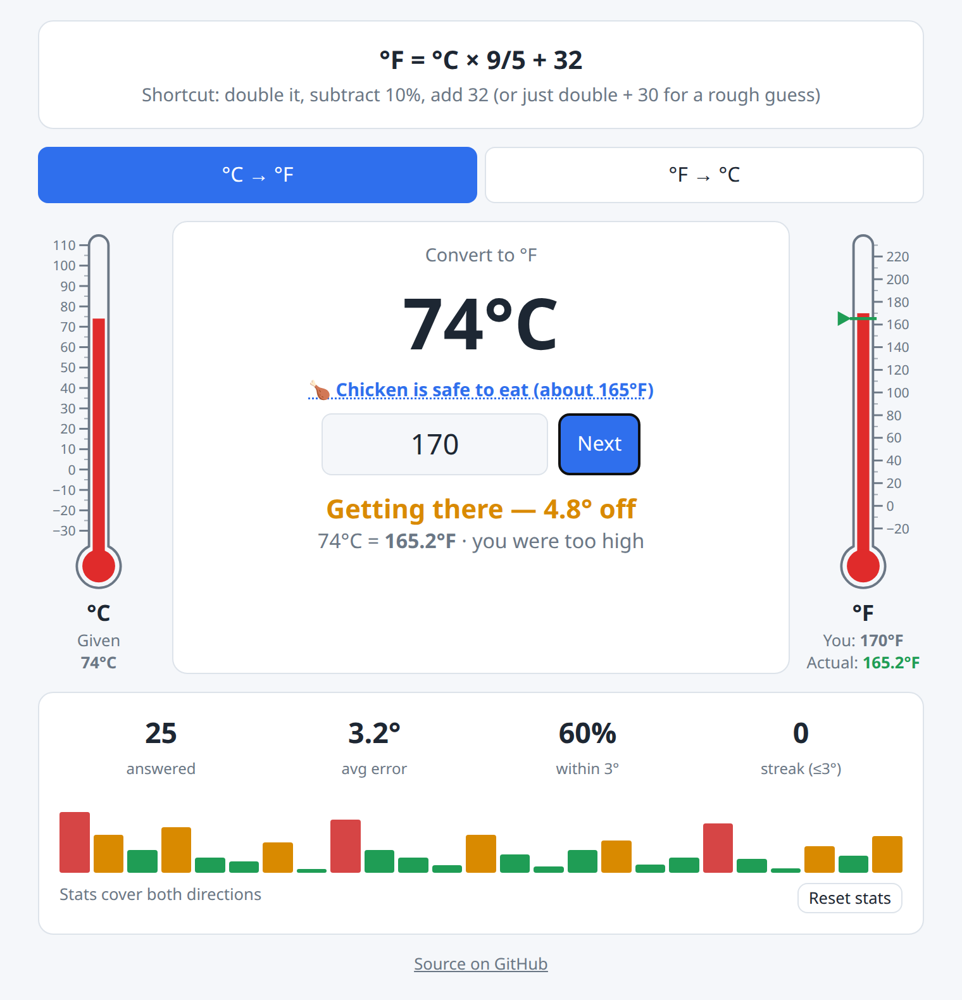

# Temperature Trainer

A small web game for learning Celsius ↔ Fahrenheit conversions well enough to estimate them by memory.



## Play

Open `index.html` in a browser, or serve the folder:

```sh
python3 -m http.server
```

No build step or dependencies.

## Features

- Formula and a mental shortcut shown at the top for the current direction
- Switch between °C → °F and °F → °C
- Random temperatures; type your answer and press Enter (Enter again for the next one)
- Thermometers on each side (°C left, °F right): the given temperature fills one, the other stays blank until you guess. After checking, it shows your guess in red fluid, the actual reading as a green marker, and its scale numbers
- Feedback shows how many degrees off you were, the exact answer, and whether you were too high or too low
- Landmark questions (about 1 in 6): freezing and boiling water, room temperature, body temperature, chicken-safe, fridge, a hot day, medium-rare steak and a hot shower. Each is labeled and links to Wikipedia
- Stats across both directions: answered, average error, % within 3°, current streak, and a bar strip of recent errors
- Stats are saved in the browser's local storage; use "Reset stats" to clear them

## Adding landmarks

Edit the `LANDMARKS` list in `index.html`: give the whole-number value in each unit (`c`, `f`), a weight `w` (higher = more frequent), a label and a link.

## Ideas

- Weather graphics that change with the temperature (snow, sun, etc.)
- Oven temperatures (needs a larger thermometer scale)
